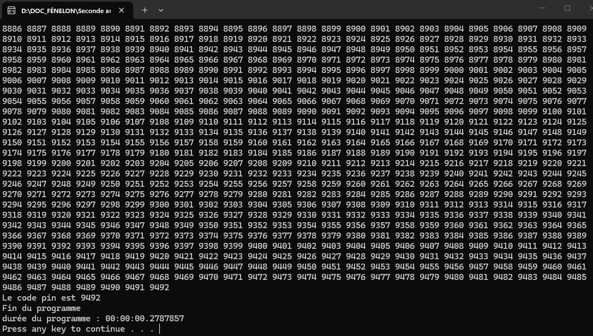

# TP - 06. SLAM - CSharp - Casser Code PIN

## C#

### Mission 2: Calculer le temps d'exécution d'un programme

Que fait le programme dans cet état?

    Le programme fait :
    - Définit le temps actuel à la variable "start"
    - écrit "Début du programme"
    - éxecute le programme 
    - écrit "Fin du programme"
    - Créer une variable "duree" qui soustrait heure de fin à l'heure de démarrage pour connaitre la durée du programme

Quelle est la durée de ce programme en secondes ?

    00,0210819 secondes

En millisecondes (ms) ?

    21,0819 ms 

### Mission 4: Force brute

Quelle est la durée du programme en secondes ?
    0,27ms

### Mission 5: Temporisation

Relancez le programme. Quelle est sa durée ?
    1min 36s 780ms

Mettez maintenant une temporisation de 1 seconde (= 1 000 ms).
Lancez le programme : quel est l’effet sur l’attaquant ?
    Trouver le bon code PIN prendra longtemps en raison du temsp d'attente entre chaques tentatives (à moins d'avoir de la chance).

---
## Python

### Mission 2: Calculer le temps d'exécution d'un programme

Quelle est la durée de ce programme en secondes ?

    0.00016164779663085938 secondes

En millisecondes (ms) ?

    0,161 ms

### Mission 4: Force brute

Quelle est la durée de ce programme en secondes ?

    0.0007932186126708984 secondes

En millisecondes (ms) ?

    0,793 ms

### Mission 5: Temporisation

Relancez le programme. Quelle est sa durée ?
    Tempo : 5ms
    Code : 5583
    Temps : 30.456 secondes

---
## PHP

### Mission 2: Calculer le temps d'exécution d'un programme

Quelle est la durée de ce programme en secondes ?

    2.002 secondes

### Mission 4: Force brute

Quelle est la durée de ce programme en secondes ?

    0.011854887008667 secondes

En millisecondes (ms) ?

    1,18ms

### Mission 5: Temporisation

Relancez le programme. Quelle est sa durée ?
    
    Tempo : 5ms
    Code : 4584
    Temps : 63.709323883057 secondes
